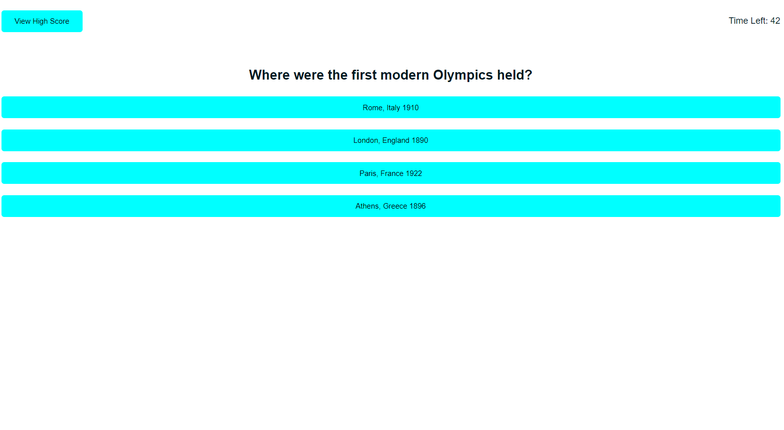

# Quiz Game
A timed quiz game with multiple-choice questions. This app will run in the browser and will feature dynamically updated HTML and CSS powered by JavaScript code.

# Features for the App 
-----------------------------------------------------------------------  
-	User is presented with home page with the title and an option to start the game. 
-	When user click on the start button a timer starts and user is presented with a question.
-	When user answers a question, the next question is presented.
-	When user answers a question incorrectly time is subtracted from the clock.
-	When all questions are answered, or the timer reaches 0 then the game is over.
-	When the game is over, an option to save initials and score are presented.
-	Local storage is used to save usernames and high scores. Upon clicking the highscore button users can view past highscores.

# Built with
-----------------------------------------------------------------------
- HTML  
- CSS 
- JavaScript

# Links
-----------------------------------------------------------------------
### [ Deployed Website](https://micky-ad.github.io/Quiz_Game/)
### [Repository](https://github.com/Micky-Ad/Quiz_Game)

# Screenshot:
----------------------------------------------------------------------

 

# Usage:
----------------------------------------------------------------------
-	Fun quiz application which runs on the browser.

# License:
-----------------------------------------------------------------------
[MIT](https://choosealicense.com/licenses/mit/)

